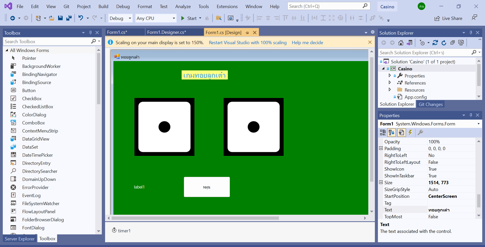

## สรุปอบรม IT Pro 2 เรื่อง การใช้งาน โปรแกรม Visual Studio

### โปรแกรม Visual Studio

เป็นโปรแกรมช่วยในการพัฒนาซอฟต์แวร์ (Integrated Development Environment หรือ IDE) ที่ถูกพัฒนาโดย Microsoft และใช้สำหรับการพัฒนาแอปพลิเคชันต่าง ๆ อาทิเช่น แอปพลิเคชันบนเดสก์ท็อป (desktop), เว็บ, มือถือ, และแอปพลิเคชันที่ใช้บนคลาวด์ (cloud-based applications) ซึ่งมีลักษณะที่แบ่งเป็น IDE (Integrated Development Environment) ที่ให้บริการเครื่องมือต่าง ๆ สำหรับการพัฒนาซอฟต์แวร์ทั้งหมด.

#### คุณสมบัติที่สำคัญของ Visual Studio ประกอบด้วย:

- Code Editor: Visual Studio มี Code Editor ที่มีความสามารถมากมาย เช่น การเน้นไวยากรณ์ (syntax highlighting), การเสริมคำ (code completion), และการนำทางในโค้ด (code navigation) เพื่อช่วยให้นักพัฒนาสามารถเขียนและแก้ไขโค้ดได้ง่ายขึ้น

- Debugger: IDE นี้มี Debugger ที่มีประสิทธิภาพสูง ช่วยให้นักพัฒนาสามารถหาและแก้ไขบั๊กในโค้ดได้ รองรับฟีเจอร์ต่าง ๆ เช่น breakpoints, watch windows, และ step-through debugging

- เครื่องมือที่ใช้ร่วมกัน: Visual Studio มีเครื่องมือที่ใช้ร่วมกันต่าง ๆ สำหรับออกแบบอินเตอร์เฟซผู้ใช้ การจัดการฐานข้อมูล และการจัดการเวอร์ชันคอนโทรล ซึ่งรองรับตัวเลือกการพัฒนาหลาย ๆ รูปแบบ เช่น Windows Forms, WPF (Windows Presentation Foundation), และ ASP.NET สำหรับการสร้างอินเตอร์เฟซผู้ใช้

- การสนับสนุนภาษา: Visual Studio รองรับภาษาการเขียนโค้ดหลาย ๆ ภาษา เช่น C#, C++, Visual Basic, F#, Python และอื่น ๆ นักพัฒนาสามารถเลือกใช้ภาษาที่เหมาะกับโครงการของพวกเขา

- ส่วนขยายและส่วนเสริม: Visual Studio สามารถถูกขยายด้วยส่วนขยายและส่วนเสริมต่าง ๆ ทำให้นักพัฒนาสามารถปรับแต่งและเพิ่มประสิทธิภาพในสภาพแวดล้อมการพัฒนาของพวกเขาได้ ส่วนขยายเหล่านี้สามารถให้เครื่องมือเพิ่มเติม แม่แบบ และคุณสมบัติ

- การผนวกรวมกับ Azure: Visual Studio ผนวกรวมได้อย่างดีกับ Microsoft Azure ทำให้ง่ายต่อการสร้าง ใช้งานและบริหารจัดการแอปพลิเคชันบนแพลตฟอร์มคลาวด์ของ Microsoft.

- การพัฒนาร่วมกับแพลตฟอร์มต่างๆ: Visual Studio รองรับการพัฒนาข้ามแพลตฟอร์ม ทำให้นักพัฒนาสามารถสร้างแอปพลิเคชันสำหรับ Windows, macOS, Android, iOS, และ Linux ได้

### การสร้างเกมส์ ทอยลูกเต๋า


#### ขั้นตอนการพัฒนาเกมทอยลูกเต๋า



```
namespace Casino
{
    public partial class Form1 : Form
    {
        public Form1()
        {
            InitializeComponent();
        }

        private void Form1_Load(object sender, EventArgs e)
        {

        }

        int i = 0;
        int j = 0;
        void Randompb()
        {
            Random rnd = new Random();


            i = rnd.Next(1, 7);
            j = rnd.Next(1, 7);

            //label1.Text = i.ToString();
            //label1.Text = label1.Text + " " + j.ToString();

            switch (i)
            {
                case 1:
                    pb1.Image = Casino.Properties.Resources.d1;
                    break;
                case 2:
                    pb1.Image = Casino.Properties.Resources.d2;
                    break;
                case 3:
                    pb1.Image = Casino.Properties.Resources.d3;
                    break;
                case 4:
                    pb1.Image = Casino.Properties.Resources.d4;
                    break;
                case 5:
                    pb1.Image = Casino.Properties.Resources.d5;
                    break;
                case 6:
                    pb1.Image = Casino.Properties.Resources.d6;
                    break;
            }
            switch (j)
            {
                case 1:
                    pb2.Image = Casino.Properties.Resources.d1;
                    break;
                case 2:
                    pb2.Image = Casino.Properties.Resources.d2;
                    break;
                case 3:
                    pb2.Image = Casino.Properties.Resources.d3;
                    break;
                case 4:
                    pb2.Image = Casino.Properties.Resources.d4;
                    break;
                case 5:
                    pb2.Image = Casino.Properties.Resources.d5;
                    break;
                case 6:
                    pb2.Image = Casino.Properties.Resources.d6;
                    break;
            }
        }

        private void btn1_Click(object sender, EventArgs e)
        {
            timer1.Start();

        }

        int count = 0;
        private void timer1_Tick(object sender, EventArgs e)
        {

            count = count + 1;
            Randompb();
            if (count <= 30)
            {

                timer1.Stop();

                lb1.Text = $"{i + j}";

            }
        }
    }
}

```

#### การสร้างเว็บ

#### การดึงข้อมูล JSON
